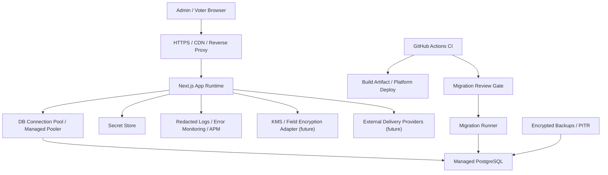

# Production Deployment Plan

This plan defines the production deployment architecture and operating controls for the online voting MVP. It is a pre-deployment design document only. It does not create cloud resources, store production secrets, or approve production launch.

## Deployment Target Options

| Option | Strengths | Weaknesses | Beta fit | Long-term production fit |
| --- | --- | --- | --- | --- |
| Vercel + managed PostgreSQL | Excellent Next.js App Router fit, simple HTTPS/domain setup, fast preview deployments, low operational overhead | Database connection pooling and migration execution need careful setup; platform logs/APM redaction must be validated; long-running operational tasks may need separate runner | Strong for internal beta if managed DB and redaction controls are configured | Good for app runtime; production data posture depends on managed DB, secret, backup, logging, and migration controls |
| Render/Railway/Fly.io + managed PostgreSQL | Simple app deployment, built-in service/environment management, managed Postgres options, easier container-style runtime | Platform maturity and operational controls vary; backup/PITR/log redaction details must be verified per vendor | Alternative path only under the current self-hosted direction | Medium; can work if vendor controls meet audit/security needs |
| AWS ECS/Fargate + RDS PostgreSQL | Strong isolation, mature IAM/Secrets Manager/KMS/RDS backup/PITR, explicit network controls, production-grade observability options | Higher setup and operating complexity; slower initial delivery; requires more infrastructure ownership | Heavier than necessary for first internal beta | Strongest long-term production fit |
| EC2/self-hosted Docker Compose + PostgreSQL | Familiar operational model, direct server control, straightforward local-to-server mental model | Operator owns patching, TLS, process supervision, backups, observability, firewall, SSH, and incident response | Current internal beta direction, with strict limits and non-production/approved low-risk data | Weak unless hardened substantially |
| Self-hosted app + managed PostgreSQL | App remains user-operated while DB backup/PITR can be delegated | Requires secure DB networking, credential handling, provider review, and backup policy review | Strong alternative if self-hosting app but not database | Better production bridge than all-in-one self-hosting |

## Recommended Strategy

Use a two-stage strategy:

1. Internal beta staging: **self-hosted Linux server**, preferably Docker Compose with app runtime, PostgreSQL, and Caddy/Nginx reverse proxy, with CI guardrails, non-production/approved low-risk data, explicit migration deploy, staging-only secrets, and no legal-effect voting. See `docs/staging-deployment-plan.md` and `docs/self-hosted-staging-runbook.md`.
2. Production: managed PostgreSQL with backup/PITR, managed secret store, explicit migration approval, production logging redaction, restore rehearsal, administrator MFA/WebAuthn, KMS-backed field encryption, and branch protection.

Preferred long-term architecture is AWS ECS/Fargate or an equivalent managed container/app platform plus managed PostgreSQL, secrets manager, KMS, backup/PITR, HTTPS, and centralized redacted logging. A simpler managed Next.js platform can be used for beta only if the database, secret, log, and migration controls are explicitly verified.

Step 27 decision note: the internal beta staging target changed from Render to a user-operated self-hosted server. Render remains an archived alternative path only.

## Production Architecture

## Components

- Web app runtime: Next.js App Router running a production build with `npm run build` and `npm run start`, or the platform equivalent.
- PostgreSQL: self-hosted staging may use Docker/host PostgreSQL; production should use managed PostgreSQL or a thoroughly hardened self-hosted PostgreSQL plan with backup/restore rehearsal. No SQLite.
- Secret store: platform secret manager or cloud secret store. Production secrets must not live in git, `.env`, shell history, CI logs, or runbook examples.
- Migration execution point: controlled deployment step or separate migration runner after approval, not an unreviewed app startup side effect.
- Admin bootstrap: one-time command using environment-provided username/password and `BOOTSTRAP_CONFIRM=CREATE_INITIAL_ADMIN`; disable or restrict after initial setup.
- Backup/restore: managed encrypted backup, point-in-time recovery, restore rehearsal, and documented retention.
- Logging/APM: centralized logs with strict redaction and no token/PII/linkage payloads.
- CDN/proxy/HTTPS: mandatory TLS, HSTS after verification, request size limits, security headers, and access log redaction.
- Domain/TLS: production domain managed through the chosen platform or proxy, with HTTPS required before real users.
- CI/CD: GitHub Actions guardrail workflow must pass before deployment; production deploy workflow is not yet implemented.
- Rollback: application artifact rollback plus database restore plan. Prisma Migrate does not provide automatic production rollback.
- External delivery providers: future adapter boundary only; no production provider until redaction and delivery tests exist.
- KMS/field encryption: future adapter boundary for encrypted PII fields and key rotation.

## Production Environment And Secret Inventory

| Name | Required | Secret | Storage | Rotation guidance |
| --- | --- | --- | --- | --- |
| `NODE_ENV` | Yes | No | Runtime env | Must be `production` in production |
| `DATABASE_URL` | Yes | Yes | Secret store | Rotate DB credentials on incident and regular schedule |
| `APP_URL` | Yes | No | Runtime env | Update when domain changes |
| `SESSION_SECRET` | Yes | Yes | Secret store | High entropy; rotate with session invalidation plan |
| `ENCRYPTION_KEY` | Yes currently | Yes | Secret store / future KMS | Replace with KMS-backed envelope encryption before production PII |
| `HMAC_KEY` | Yes | Yes | Secret store | Rotation requires identifier/hash migration plan |
| `BOOTSTRAP_ADMIN_USERNAME` | Bootstrap only | Sensitive | One-time secret/input | Remove after bootstrap |
| `BOOTSTRAP_ADMIN_PASSWORD` | Bootstrap only | Yes | One-time secret/input | Remove after bootstrap; never reuse |
| `BOOTSTRAP_CONFIRM` | Bootstrap only | No | One-time env | Use only for explicit production bootstrap |
| Provider keys | Future | Yes | Secret store | Not configured until providers are implemented |
| Logging/APM DSN | Future | Sensitive | Secret store | Must support payload redaction |
| KMS key identifier | Future | Sensitive metadata | Secret store/IAM | Managed by cloud KMS policy |

Secret generation rules:

- Generate high-entropy random values with a password manager, cloud secret generator, or equivalent.
- Keep all secret-like values at least 32 bytes/characters of entropy where applicable.
- Never commit real values to `.env.example`, `.env`, docs, screenshots, CI logs, or issue comments.
- Define rotation runbooks before collecting production voter data.

## Managed PostgreSQL Operations

- Version: use a supported PostgreSQL major version equal to or newer than local `postgres:16` unless compatibility testing proves otherwise.
- Connection management: Next.js server runtimes can create many concurrent connections. Use a managed pooler or provider-recommended pooling strategy for production.
- Migration: run `npx prisma migrate deploy` only after approval, backup, and maintenance decision.
- Backup: enable encrypted automated backups and point-in-time recovery.
- Backup retention: define based on privacy/legal policy before production; longer backup retention must be reconciled with deletion requests.
- Restore rehearsal: perform restore into a non-production database before launch and after major migration changes.
- Access control: separate app DB user, migration DB user, read-only audit/ops user if needed, and break-glass DBA access.
- Cleanup: production DB cleanup scripts are forbidden. E2E cleanup must never point at production.
- Environment separation: production, beta/staging, CI, E2E, and local DBs must be distinct.
- Query logs: disable raw parameter logging or redact sensitive values before centralized ingestion.

## Migration Approval Procedure

1. PR includes Prisma schema and generated migration SQL.
2. Reviewer checks for destructive SQL, table drops, column drops, raw SQL, and data rewrites.
3. Reviewer checks anonymous voting FK guardrails:
   - no Ballot/Vote to EligibleVoter/VotingCredential/User/VoterSession
   - no AnonymousBallotGroup to voter identity/auth/session objects
   - no CredentialEvent to Ballot/AnonymousBallotGroup/SubmissionEvent
   - no SubmissionEvent to voter identity/auth/session objects
4. Reviewer confirms `unique_current_ballot_per_group` partial unique index remains present.
5. CI guardrail workflow passes.
6. Production backup and restore point are confirmed.
7. Maintenance window is selected if migration can lock large tables or affect active voting.
8. Migration runner executes `npx prisma migrate deploy`.
9. Operator verifies migration status, partial index, seed compatibility, and smoke routes.
10. If migration fails, stop deployment; do not start the new app version until database state is understood.

Rollback limits:

- Application rollback can redeploy a previous artifact.
- Database rollback usually requires a restore or manual forward-fix migration.
- Prisma Migrate does not provide automatic production rollback.
- Irreversible migrations require explicit approval and restore rehearsal.

## Logging, APM, And Access Log Redaction

Never log or export:

- invite token originals
- voter session token originals
- admin session token originals
- step-up token originals
- ballot group token originals
- `ballotGroupTokenHash`
- password originals
- one-time code originals
- raw IP/User-Agent, unless stored only as masked/summary according to policy
- Ballot/Vote/AnonymousBallotGroup values linked to a voter identity
- request/response bodies containing PII or voting choices

Review these log surfaces before production:

- reverse proxy access logs
- platform request logs
- Next.js server logs
- error monitoring payloads
- APM trace attributes and breadcrumbs
- database query logs and slow query logs
- browser console logs and source maps
- CI logs and Playwright traces

Required controls:

- redaction middleware or platform-level filters for token-like values
- disabled request body logging by default
- masked IP/User-Agent handling
- restricted log access by role
- retention policy for logs distinct from voter registry data
- audit of log exports

## Backup, Restore, And Retention

Minimum production policy before real data:

- automated encrypted DB backups
- point-in-time recovery enabled
- backup access restricted to trusted operators
- restore rehearsal documented and repeated after migration changes
- migration-before-backup gate
- audit/security log preservation
- explicit retention schedule for voter registry, invitations, credentials, sessions, reports, and logs
- deletion request workflow aligned with backup retention limits

Open policy decisions:

- exact backup retention period
- exact audit/security log retention period
- deletion SLA for organization-requested purge
- treatment of backups after deletion requests
- legal hold policy

## Internal Beta Checklist

Internal beta may proceed only when:

- `docs/staging-deployment-plan.md` has been reviewed for the selected staging platform.
- staging uses the self-hosted runbook in `docs/self-hosted-staging-runbook.md`, or an explicitly approved alternative.
- staging secrets are separate from local, CI, and future production secrets.
- staging migration is executed through an explicit `npx prisma migrate deploy` run, not an implicit app startup side effect.
- firewall, SSH, reverse proxy, HTTPS, and PostgreSQL exposure are reviewed.
- backup and restore approach is understood before migration.
- data is non-production or explicitly approved low-risk internal data
- legal-effect voting is prohibited
- administrators are limited and known
- external delivery providers remain disabled or are manually controlled
- voters are warned about MVP limitations
- CI guardrail workflow is green
- production-like rehearsal has passed
- branch protection is enabled
- logs are manually reviewed for token/PII leakage
- backup expectations are documented as not production-grade
- current local/CI E2E cleanup is not pointed at staging or production

Internal beta must not claim:

- legal enforceability
- strong external identity assurance
- production-grade backup/restore
- provider-grade delivery assurance
- complete KMS/field encryption

## Production Blockers

- Administrator MFA/WebAuthn is not implemented.
- KMS-backed field encryption adapter is not implemented.
- External delivery providers are not implemented.
- PDF/CSV/Excel report file generation is not implemented.
- Backup/restore automation and restore rehearsal are not complete.
- Production log/APM/access-log redaction is not verified.
- `npm audit` moderate findings remain unresolved or unaccepted.
- Legal-effect voting is not supported.
- Terms of service and privacy policy may be required before processing real organization/user data.
- Branch protection and first remote CI run must be confirmed in GitHub.
- Internal beta staging must be provisioned and smoke-tested before using any real participant data.
- Self-hosted staging backup/restore and reverse-proxy log redaction must be verified before production.

## Pre-deployment Checklist

- CI guardrail workflow is green on the deployment commit.
- Branch protection is enabled for `main`.
- Production-like rehearsal has been run after the latest migration.
- Production secrets are stored only in the approved secret store.
- Production DB is managed PostgreSQL with backup/PITR.
- Migration SQL has approval.
- Fresh pre-migration backup exists.
- Admin bootstrap plan is approved and one-time.
- HTTPS/domain/TLS is configured.
- Logging/APM redaction is verified.
- External providers remain disabled until provider tests exist.
- Production blockers are closed or explicitly accepted by decision makers.
