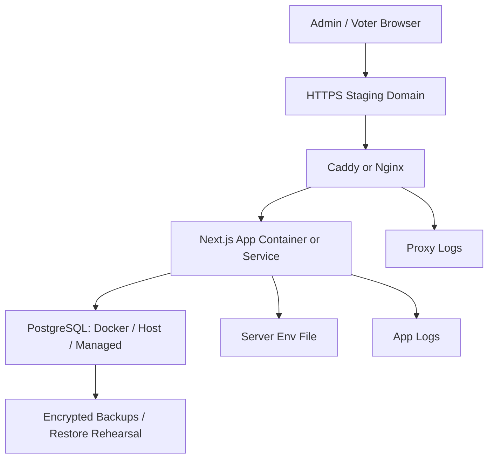

# Self-hosted Staging Runbook

This runbook describes how to prepare a self-hosted staging server for the online voting MVP. It does not deploy to a real server, create secrets, change schema, generate migrations, or enable external providers.

## Current Step 28 Status

Step 28 prepares deployment artifacts on the local macOS development machine before the office Linux server is available.

Prepared draft artifacts:

- `Dockerfile`: multi-stage Next.js production image draft.
- `.dockerignore`: excludes secrets, local build output, tests, docs, and git metadata from image context.
- `docker-compose.staging.yml`: draft app + PostgreSQL staging stack.
- `.env.staging.example`: placeholder-only staging env template.
- `docs/self-hosted-reverse-proxy-examples.md`: Caddy and Nginx examples.
- `scripts/backup-postgres-staging.sh.example`: staging `pg_dump` backup example.

Not performed in Step 28:

- no office Linux server access.
- no staging container startup.
- no real `.env.staging` creation.
- no secret generation.
- no migration execution.
- no schema change.
- no app feature change.

Actual server pre-flight remains a later step and must be run on the office Linux server before using these artifacts.

Server-agent entry point for the next handoff: `docs/server-agent-handoff.md`.

Current staging operations handoff: `docs/staging-operations-handoff.md`.

## Deployment Model

Recommended first self-hosted staging model:

- Linux server operated by the user.
- Docker Compose for the app stack.
- PostgreSQL in Docker for first staging, unless a managed PostgreSQL database is explicitly chosen.
- Caddy or Nginx reverse proxy with HTTPS/TLS.
- Server-local env/secret file with restricted permissions.
- Explicit operator-run migration, seed, and admin bootstrap commands.
- Operator-owned backup and restore procedures.

Alternative models:

- Node/systemd + host PostgreSQL if the operator prefers classic Linux service management.
- App container + managed PostgreSQL if database backup/PITR should be delegated to a provider.

## Server Requirements

Minimum staging expectations:

- Maintained Linux distribution, preferably Ubuntu 22.04 LTS or 24.04 LTS.
- Non-root deploy user.
- SSH key-based login.
- Firewall enabled.
- Only required ports exposed:
  - `22/tcp` for SSH, preferably restricted by source IP.
  - `80/tcp` and `443/tcp` for HTTP/HTTPS.
  - PostgreSQL port not publicly exposed.
- Docker and Docker Compose installed if using the recommended model.
- Sufficient disk for database volume, logs, and backups.
- Time synchronization enabled.
- Domain or subdomain ready for staging.

## Architecture



## Pre-flight Checklist

Use this exact format before starting provisioning:

```text
CI status:
staging branch:
branch protection:
deployment target: self-hosted
server ready:
server OS:
Docker ready:
Docker Compose ready:
domain ready:
HTTPS/reverse proxy ready:
PostgreSQL strategy:
backup plan understood:
staging-only secrets ready:
production secret/DB reuse:
runbook opened:
```

Go only if:

- CI is green.
- staging branch is fixed.
- server is ready.
- production secrets and production DB are not used.
- backup and restore approach is understood.
- operator has this runbook open.

## Directory And File Layout

Recommended server layout:

```text
/srv/voting-service-web/
  repo/
  env/
    staging.env
  backups/
  logs/
```

Recommended permissions:

```bash
chmod 700 /srv/voting-service-web/env
chmod 600 /srv/voting-service-web/env/staging.env
```

Do not store `staging.env` in git.

## Environment Values

Required:

- `NODE_ENV=production`
- `APP_URL`
- `DATABASE_URL`
- `SESSION_SECRET`
- `ENCRYPTION_KEY`
- `HMAC_KEY`

Bootstrap-only:

- `BOOTSTRAP_ADMIN_USERNAME`
- `BOOTSTRAP_ADMIN_PASSWORD`
- `BOOTSTRAP_CONFIRM=CREATE_INITIAL_ADMIN`
- `BOOTSTRAP_TENANT_NAME`
- `BOOTSTRAP_ORGANIZATION_NAME`
- `BOOTSTRAP_ADMIN_ROLE`

Disabled/future:

- username provider env
- SMS provider env
- Kakao provider env
- external identity/SSO env
- KMS env
- APM/logging env until redaction is verified

Secret rules:

- Use staging-only random values.
- Never reuse production secrets.
- Never paste real values into docs, chat, PRs, issue comments, screenshots, or logs.
- Remove bootstrap-only values after bootstrap.
- Keep env file readable only by the deploy user.

## Docker Compose Staging Decision

Current repository `docker-compose.yml` is local-development only and starts PostgreSQL only.

Do not reuse it as a production/staging deployment file without review.
Do not run `npm run db:up` to manage staging. That script is reserved for the
separate local-development Compose project and must not replace the staging
`postgres` container or volume.

Draft file prepared in Step 28: `docker-compose.staging.yml`.

The draft assumes:

- app runs in Docker.
- PostgreSQL runs in Docker.
- app binds to host localhost only through `${APP_HOST:-127.0.0.1}:${APP_HOST_PORT:-3334}:3000`.
- PostgreSQL has no host port mapping.
- reverse proxy is the existing user-managed Caddy/Nginx, outside this Compose file.
- staging env is read through Compose `--env-file`, and the app service receives only the minimum runtime env values.

Before using it on the office Linux server, confirm:

- app container build strategy.
- PostgreSQL strategy.
- reverse proxy strategy, with upstream `127.0.0.1:3334`.
- persistent volume paths.
- backup location.
- env file path.
- restart policy.
- network exposure.

Recommended future Compose services:

- `app`
- `postgres`, only if using Docker Postgres
- no reverse proxy service by default; Caddy is user-managed on this server

Initial recommendation: keep reverse proxy host-managed. Do not generate, overwrite, stop, or restart Caddy from this app deployment runbook unless the operator explicitly chooses to do so.

## Provisioning Command Runbook

Commands below show shape and order. Do not paste real secrets into command history.

1. SSH to server:

```bash
ssh deploy@staging-host
```

2. Clone or update repo:

```bash
cd /srv/voting-service-web/repo
git pull --ff-only
```

3. Create/update server env file outside git:

```bash
editor /srv/voting-service-web/env/staging.env
chmod 600 /srv/voting-service-web/env/staging.env
```

4. If using the draft Docker Compose path, validate the compose file first without real secrets:

```bash
STAGING_ENV_FILE=.env.staging.example docker compose --env-file .env.staging.example -f docker-compose.staging.yml config
```

5. On the server, copy the server-local env file to the repo checkout as `.env.staging` or set `STAGING_ENV_FILE` to the server env file path. Then validate with the real staging env file:

```bash
docker compose --env-file .env.staging -f docker-compose.staging.yml config
```

6. Install dependencies or build app image:

```bash
npm ci
npm run db:generate
npm run build
```

7. Apply migrations:

```bash
npx prisma migrate deploy
```

8. Seed RBAC data:

```bash
npm run db:seed
```

9. Verify the current ballot partial unique index:

```sql
SELECT indexname, indexdef
FROM pg_indexes
WHERE tablename = 'ballots'
  AND indexname = 'unique_current_ballot_per_group';
```

10. Bootstrap first admin:

```bash
NODE_ENV=production npm run admin:bootstrap
```

11. Run bootstrap again and confirm duplicate creation is refused:

```bash
NODE_ENV=production npm run admin:bootstrap
```

12. Remove bootstrap-only env values from server env file.
13. Start or restart app.
14. Confirm the user-managed Caddy reverse proxy points to `127.0.0.1:3334`.
15. Confirm HTTPS.
16. Run smoke test.
17. Review logs for leakage.
18. Take initial backup.

## Reverse Proxy

This server uses a user-managed Caddy reverse proxy outside `docker-compose.staging.yml`.

Do not create, overwrite, stop, or restart Caddy from this runbook without explicit operator approval. The voting service app must only listen on the host-local upstream `127.0.0.1:3334`.

Minimum requirements:

- HTTPS enabled.
- HTTP redirects to HTTPS.
- upstream points to `127.0.0.1:3334`.
- request body limits set conservatively.
- proxy access logs reviewed for token leakage.
- PostgreSQL not exposed through proxy or public ports.

Do not add a fake health endpoint. Use `/admin/login` and `/voter/invite` as manual smoke routes until a real health endpoint is implemented.

## Firewall And SSH

Recommended:

- disable password SSH login.
- restrict SSH to operator IPs if possible.
- expose only `80/tcp` and `443/tcp` publicly.
- keep PostgreSQL bound to internal Docker network or localhost only.
- avoid running app as root.

## Backup

Minimum staging backup flow:

1. Take backup before migration.
2. Store backup outside the app repo.
3. Encrypt backup before offsite copy.
4. Record backup filename, timestamp, database name, and operator.
5. Rehearse restore into a non-production database.

Example shape:

```bash
pg_dump "$DATABASE_URL" --format=custom --file "/srv/voting-service-web/backups/staging-YYYYMMDD.dump"
```

Draft helper prepared in Step 28:

```bash
scripts/backup-postgres-staging.sh.example
```

Copy and review it on the server before use. It intentionally refuses production-looking database URLs and does not store database credentials in the file. The current template defaults to Docker Compose backup mode, which runs `pg_dump` inside the PostgreSQL container and keeps PostgreSQL off the host network.

For Docker Postgres, also consider volume snapshot/backup. A dump is still needed for portable restore testing.

Current staging snapshot record:

- Backup storage: `/mnt/data_4tb/voting-service-web/backups/`
- Format: compressed PostgreSQL custom-format dump (`.dump.gz`)
- Encryption: not yet encrypted; move to encrypted/offsite storage before relying on beta data.
- Integrity checks performed: `gzip -t` and `pg_restore --list`.
- Full restore rehearsal: passed once in Step 35 against an isolated temporary PostgreSQL container with no host port exposure.

Step 37/38 backup hardening decision:

- Age-based encrypted backup setup is deferred for the current staging/internal beta phase.
- Reason: operator-only private-key custody would concentrate recovery responsibility, and private-key loss would make encrypted backups unrecoverable.
- Current accepted risk: local gzip backup with file mode `600`, restricted server access, non-production/internal beta data only, no legal-effect voting, and no public production operation.
- Production blocker: backup encryption, offsite backup, key custody/recovery policy, and recurring restore drills.
- Current server tools: host `gzip`, `gpg`, and `rsync` are available; host `age`, `rclone`, and `pg_dump` were not available in PATH; the Docker PostgreSQL container has `pg_dump`.
- Current automation state: `scripts/backup-postgres-staging.sh.example` supports Docker Compose backup, optional encryption if a future policy enables it, and optional `rsync` offsite dry-run. A real server-local script must remain untracked.
- Pending before production: choose encryption/offsite strategy, define key custody/recovery, create encrypted/offsite backup, and rehearse decrypt plus restore.

See `docs/backup-and-restore-plan.md` for the comparison and hardening plan.

## Restore Rehearsal

Restore into a separate non-production database:

```bash
createdb voting_service_web_restore_test
pg_restore --dbname voting_service_web_restore_test "/path/to/staging-YYYYMMDD.dump"
```

Then verify:

- migrations table exists.
- key tables exist.
- `unique_current_ballot_per_group` exists.
- no production data was used.

Do not treat a backup as operationally reliable until this restore rehearsal has been completed and recorded.

Before production, encrypted/offsite backups must additionally verify:

- decrypting the encrypted artifact without placing the private key on the staging server.
- restoring the decrypted dump into an isolated temporary PostgreSQL container.
- downloading or reading the offsite copy and restoring that artifact.
- recurring restore drill evidence and cleanup of temporary restore resources.

## Smoke Test

Admin:

- HTTPS loads.
- `/admin/login` loads.
- admin login works.
- session restore works after refresh.
- logout works.
- create election draft.
- add question/options.
- add/import test voter.
- request review.
- approve/schedule/open.
- prepare/send invitation stubs.

Voter:

- `/voter/invite` loads.
- invite token is not in URL path.
- identifier verification works.
- election info loads.
- ballot submit works.
- revote works.
- completion page does not display previous anonymous choices.

Result:

- close election.
- tally.
- confirm.
- publish.
- voter/public result is visible according to policy.

## Routine Operations

Use `docs/staging-operations-handoff.md` for the current internal beta operating surface, including health checks, restart commands, log masking rules, backup posture, emergency stop criteria, and production blockers.

## Staging Test Data Cleanup

After the Step 33 MVP smoke, the staging database contained:

- one successful published `Staging Smoke Vote step33-*` election.
- two failed `ready_for_review` `Staging Smoke Vote step33-*` draft elections.

Step 36 cleanup result:

- the two failed `ready_for_review` draft elections were removed after backup confirmation and exact target-count verification.
- dependent non-audit operational records for the failed drafts were removed in a transaction.
- the successful published smoke election was preserved.
- audit/security events were left untouched.

Default future cleanup policy:

- Preserve the successful published smoke election as short-term evidence for beta readiness review.
- Remove only failed draft smoke elections after explicit operator approval.
- Do not delete production-like or non-`step33-*` data.
- Do not print raw PII, invite tokens, token hashes, ballot group hashes, session values, or voter-to-ballot linkage while inventorying or deleting.

Cleanup plan for failed drafts:

1. Confirm the target title prefix and states before deletion.
2. Confirm the database is the staging Docker Compose PostgreSQL, not production.
3. Count dependent rows by election before deletion.
4. Delete dependent rows in FK-safe order, including result/report/correction records if present, submission/vote/ballot/group records if present, voter sessions, invitations, voting credentials, eligible voters, registry imports, questions/options, state/change history, delivery events, and finally the failed draft elections.
5. Recount the same targets after deletion.
6. Leave audit/security events untouched unless an explicit retention decision says otherwise.

Do not run future destructive cleanup without an explicit operator approval for the exact target set.

## Staging RBAC Drift

Step 33 required a staging-only DB role named `StagingSmokeOperator` because the seeded `ElectionManager` role intentionally does not include approval and result-publication permissions. This role is not part of the source guardrail role mapping or seed.

Recommended handling:

- Treat `StagingSmokeOperator` as temporary staging drift.
- Do not copy it to production seed or source guardrails without a separate RBAC design step.
- Keep it only for internal beta staging convenience while `voting.kryp.xyz` remains a non-production environment.
- Before production, remove it or replace it with a source-controlled role model that separates approval and publication duties as intended.
- For production, decide whether operational smoke should use a dedicated scripted operator role, separate approver/publisher accounts, or a documented combination of existing seeded roles.

Step 36 sanity summary:

- source guardrails/seed include no `StagingSmokeOperator` role.
- staging DB contains one assigned user for the role.
- staging DB role permission count is 27, including 11 high-risk operational permissions.

## Restore Rehearsal Prep

Latest known staging backup source:

- `/mnt/data_4tb/voting-service-web/backups/voting-service-web-staging-20260629T141827Z.dump.gz`

Step 35 restore rehearsal result:

- Status: passed.
- Restore target: isolated temporary PostgreSQL 16 container, volume, and network.
- Host port exposure: none.
- Staging app/PostgreSQL impact: none.
- Sanity checks: migrations table, key tables, RBAC baseline counts, ballot counts, result-version counts, and `unique_current_ballot_per_group` partial unique index.
- Cleanup: temporary restore container, volume, network, and local temporary env file removed after verification.

Recommended recurring rehearsal shape:

1. Create a temporary PostgreSQL container and volume that are not attached to the staging app network as the primary database.
2. Restore the gzip-compressed custom-format dump into a new temporary database.
3. Run sanity checks for migration history, key table existence, the `unique_current_ballot_per_group` index, and high-level row counts.
4. Do not connect the staging app to the restored database.
5. Do not print database URLs, passwords, token values, token hashes, raw voter identifiers, or voter-to-ballot linkage.
6. Remove the temporary restore container and volume after recording the result.

## Log Redaction Review

Review:

- app stdout/stderr.
- Docker logs.
- reverse proxy access logs.
- PostgreSQL logs.
- systemd journal if used.
- browser console.

Forbidden values:

- invite token original
- admin session token
- voter session token
- step-up token
- ballot group token
- `ballotGroupTokenHash`
- password
- one-time code
- raw IP/User-Agent
- Ballot ID
- Vote ID
- AnonymousBallotGroup ID
- voter-to-ballot linkage

No-go if any forbidden value appears.

## Rollback

Application rollback:

- redeploy previous git commit or previous app image.
- restart app.
- confirm compatibility with current database schema.

Database rollback:

- restore from backup or apply approved forward-fix migration.
- Prisma Migrate does not provide automatic rollback.
- never run destructive SQL without explicit approval.

## Cleanup

- Use obvious staging test tenant names.
- Archive/delete staging test data manually until a guarded staging cleanup tool exists.
- Do not run local/CI E2E cleanup against staging.
- Do not run any cleanup command against production.

## Production Blockers

Self-hosted staging does not make the app production-ready. Remaining blockers include:

- administrator MFA/WebAuthn.
- KMS-backed field encryption or approved equivalent.
- backup automation and restore rehearsal.
- reverse proxy/access-log redaction verification.
- retention/deletion policy.
- npm audit moderate finding resolution or formal acceptance.
- privacy policy/terms before real user data.
