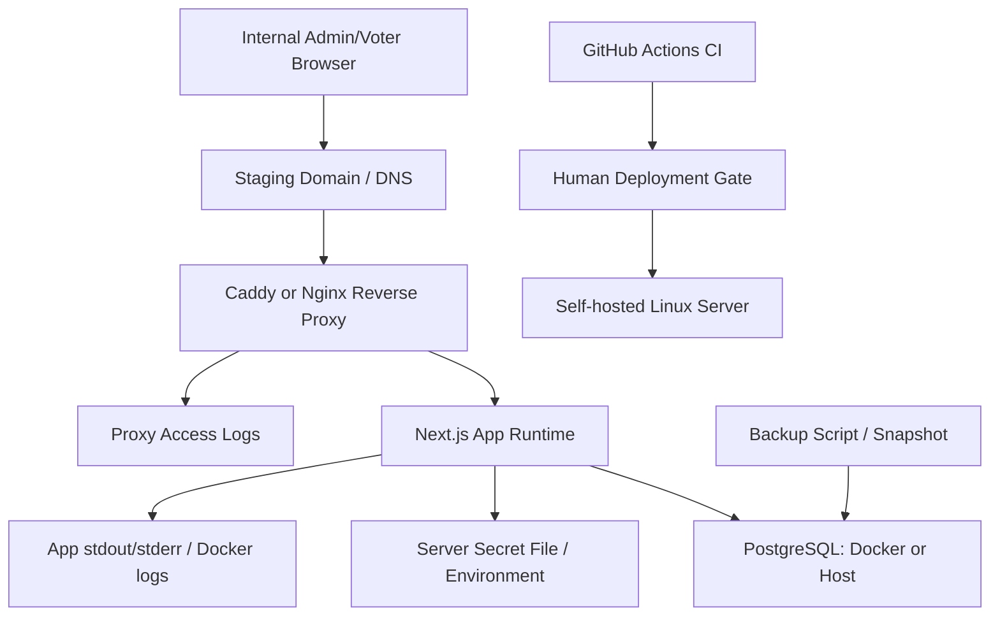

# Staging Deployment Plan

This document defines the internal beta staging target and operating procedure. It does not deploy to a server, create secrets, modify application code, or approve production launch.

## Direction Change

Step 27 changes the staging direction from an external managed platform to a user-operated self-hosted server.

Current staging target: **self-hosted Linux server**.

Render Web Service + Render Postgres remains an archived alternative path only. Do not follow the Render provisioning runbook unless the deployment target changes back to Render.

Primary runbook: `docs/self-hosted-staging-runbook.md`.

Archived alternative: `docs/render-staging-provisioning-runbook.md`.

## Deployment Target Comparison

| Option | Operating difficulty | Backup/restore | Failure response | Cost | Security posture | Migration convenience | Internal beta fit | Production expansion |
| --- | --- | --- | --- | --- | --- | --- | --- | --- |
| Docker Compose single server | Medium | Operator-owned dumps, volume snapshots, and offsite copies | Simple service restart and host-level recovery; single-host risk | Low to moderate | Good if firewall, TLS, SSH, file permissions, and log redaction are managed carefully | Good; run commands inside app container or host checkout | Recommended for current self-hosted staging | Acceptable for small production only after hardening and backup rehearsal |
| Node/systemd + host PostgreSQL | Medium-high | OS/PostgreSQL tooling; clearer host-level control | Familiar Linux service operations; more manual drift risk | Low | Strong if OS hardening is mature; higher configuration burden | Good, but depends on host Node/Prisma environment | Viable if operator prefers classic Linux ops | Better long-term than ad hoc Compose only if fully managed by ops discipline |
| Docker app + managed PostgreSQL | Medium | DB provider handles backup/PITR; app host remains operator-owned | App rollback on host, DB restore through provider | Moderate | Good split of concerns; DB credentials and network exposure still need care | Good; migration from app host to managed DB | Strong alternative if managed DB is acceptable | Best bridge from self-hosted staging to production-grade database operations |

## Recommended Staging Approach

Recommended for internal beta: **Docker Compose single server with Next.js app container, PostgreSQL container, and Caddy or Nginx reverse proxy**.

Why:

- It matches the user's self-hosted direction.
- It keeps runtime, database, reverse proxy, and backup responsibilities explicit.
- It is close enough to current local Docker/PostgreSQL development to reduce deployment surprises.
- It keeps migration/seed/admin bootstrap as deliberate operator commands.
- It can later evolve into "app container + managed PostgreSQL" if database backup/PITR requirements exceed what the server operator wants to own.

Not recommended as the first self-hosted staging path:

- Host Node/systemd without containers, unless the operator already prefers package/Node/process management on the host.
- Self-hosted production with real user data before backup/restore, log redaction, firewall, SSH, and MFA/WebAuthn blockers are resolved.

## Staging Architecture



## Staging Runtime

- Server: user-operated Linux server.
- Recommended OS: Ubuntu 22.04 LTS or 24.04 LTS, or equivalent maintained Linux distribution.
- Runtime: Docker Compose for staging.
- App: Next.js production build.
- PostgreSQL: Docker Postgres for first staging, host PostgreSQL or managed PostgreSQL as alternatives.
- Reverse proxy: Caddy or Nginx with HTTPS/TLS.
- Build command concept: `npm ci && npm run db:generate && npm run build`.
- Start command concept: `npm run start`.
- `NODE_ENV`: `production`.
- External providers: disabled.
- Legal-effect voting: disabled.
- Migration: explicit operator command, not an app startup side effect.

## Self-hosted Pre-flight Checklist

Use this format before provisioning:

```text
CI status:
staging branch:
branch protection:
deployment target: self-hosted
server ready:
server OS:
Docker ready:
Docker Compose ready:
domain ready:
HTTPS/reverse proxy ready:
PostgreSQL strategy:
backup plan understood:
staging-only secrets ready:
production secret/DB reuse:
runbook opened:
```

Expected values:

- `CI status`: `green / red / not yet run`
- `staging branch`: branch name
- `branch protection`: `enabled / not enabled / risk accepted`
- `deployment target`: `self-hosted`
- `server ready`: `yes / no`
- `server OS`: for example `Ubuntu 22.04` or `Ubuntu 24.04`
- `Docker ready`: `yes / no`
- `Docker Compose ready`: `yes / no`
- `domain ready`: `yes / no`
- `HTTPS/reverse proxy ready`: `caddy / nginx / not ready`
- `PostgreSQL strategy`: `docker-postgres / host-postgres / managed-postgres`
- `backup plan understood`: `yes / no`
- `staging-only secrets ready`: `yes / no`, values not shared
- `production secret/DB reuse`: `confirmed / not confirmed`
- `runbook opened`: `yes / no`

No-go if production secrets or a production database are needed.

## Staging Environment Matrix

| Env | Required | Secret | Scope | Notes |
| --- | --- | --- | --- | --- |
| `NODE_ENV=production` | Yes | No | App runtime | Required to disable dev/mock assumptions |
| `APP_URL` | Yes | No | App runtime | Staging HTTPS URL |
| `DATABASE_URL` | Yes | Yes | App runtime and migration command | Staging DB only |
| `SESSION_SECRET` | Yes | Yes | App runtime | Staging-only random value |
| `ENCRYPTION_KEY` | Yes | Yes | App runtime | Placeholder until KMS adapter |
| `HMAC_KEY` | Yes | Yes | App runtime | Staging-only random value; rotation requires plan |
| `BOOTSTRAP_ADMIN_USERNAME` | Bootstrap only | Sensitive | Temporary shell/env | Remove after bootstrap |
| `BOOTSTRAP_ADMIN_PASSWORD` | Bootstrap only | Yes | Temporary shell/env | Remove after bootstrap |
| `BOOTSTRAP_CONFIRM=CREATE_INITIAL_ADMIN` | Bootstrap only | No | Temporary shell/env | Required with production node env |
| Username/SMS/Kakao provider env | Future | Yes | Disabled | Do not configure until providers exist |
| KMS env | Future | Yes/sensitive | Disabled | Do not configure until KMS adapter exists |
| APM/logging env | Future | Sensitive | Disabled by default | Enable only after redaction review |

Rules:

- Do not commit `.env`, `.env.staging`, secret files, database URLs, or generated passwords.
- Store server env files with restrictive permissions, for example `chmod 600`.
- Use a dedicated deploy user where possible.
- Staging and production secrets must differ.
- Bootstrap env values must be removed after successful bootstrap.

## Docker Compose Staging Artifact

Current `docker-compose.yml` is local-development only and runs PostgreSQL only. It should remain local.

Step 28 added a separate `docker-compose.staging.yml` draft for self-hosted staging. It is a preparation artifact, not a completed server deployment.

Current draft shape:

- `app`: Next.js production app container.
- `postgres`: PostgreSQL 16 container for first staging.
- named PostgreSQL volume.
- Compose `--env-file .env.staging` for interpolation, with app runtime env values explicitly allowlisted.
- restart policies.
- private Docker network.
- app host binding to `127.0.0.1:${APP_HOST_PORT:-3000}:3000`.
- no PostgreSQL host port mapping by default.

Reverse proxy is not included in the draft Compose file yet. Prefer reusing host-level Caddy or Nginx after the actual office Linux server is inspected. Example proxy snippets live in `docs/self-hosted-reverse-proxy-examples.md`.

Before using the draft on the office Linux server, the operator must confirm:

- PostgreSQL strategy.
- reverse proxy strategy.
- domain and TLS approach.
- backup storage location.
- deployment user and directory layout.

Validate the draft without starting containers:

```bash
STAGING_ENV_FILE=.env.staging.example docker compose --env-file .env.staging.example -f docker-compose.staging.yml config
```

## Migration And Bootstrap Runbook

Operator sequence:

1. SSH to staging server as deploy user.
2. Clone or pull repository.
3. Write staging env file on the server only.
4. Prepare Docker/PostgreSQL according to the selected strategy.
5. Install dependencies or build the app image.
6. Generate Prisma client:

```bash
npm run db:generate
```

7. Apply migrations:

```bash
npx prisma migrate deploy
```

8. Seed RBAC:

```bash
npm run db:seed
```

9. Confirm the current-ballot partial unique index:

```sql
SELECT indexname, indexdef
FROM pg_indexes
WHERE tablename = 'ballots'
  AND indexname = 'unique_current_ballot_per_group';
```

10. Bootstrap first admin:

```bash
NODE_ENV=production npm run admin:bootstrap
```

11. Run bootstrap a second time and confirm duplicate creation is refused.
12. Remove bootstrap env values.
13. Start or restart app service.
14. Connect reverse proxy.
15. Confirm HTTPS.
16. Run smoke test.
17. Run log leakage review.
18. Take an initial staging backup snapshot or dump.

Do not run `prisma migrate dev` on staging.

## Smoke Test

Required:

- HTTPS staging URL loads.
- `/admin/login` loads.
- admin login succeeds.
- admin session restores after refresh.
- logout works.
- `/voter/invite` loads.
- no token/session/password values appear in visible UI.
- logs do not contain request bodies or secret env values.

MVP smoke:

- create a test election with non-real data.
- add one question and two options.
- import a test voter with non-real data.
- request review, approve, schedule/open.
- prepare/send invitation stubs.
- complete voter flow with a test invite token obtained through an operator-only path, not visible UI.
- submit ballot and revote.
- confirm completion screen does not show previous choices.
- close/tally/confirm/publish.
- verify voter/public results.

## Logging And Redaction Review

Check:

- app stdout/stderr.
- Docker logs.
- Caddy/Nginx access logs.
- PostgreSQL logs.
- systemd journal if systemd is used.
- browser console.

Forbidden values:

- invite token originals
- admin session token originals
- voter session token originals
- step-up token originals
- ballot group token originals
- `ballotGroupTokenHash`
- password originals
- one-time code originals
- raw IP/User-Agent where policy requires masked/summary storage
- Ballot/Vote/AnonymousBallotGroup identifiers
- voter-to-ballot linkage

If leakage is found, stop beta use, rotate affected staging secrets/tokens, restrict or delete accessible logs where possible, and fix logging before proceeding.

## Backup And Restore

Minimum staging backup policy:

- Take a backup before every migration.
- For Docker Postgres, use `pg_dump` plus volume backup/snapshot if available.
- Encrypt backups before moving off the server.
- Store at least one offsite copy if beta data matters.
- Document retention period.
- Rehearse restore into a non-production database.
- Preserve audit/security logs according to policy.

Example dump command shape:

```bash
pg_dump "$DATABASE_URL" --format=custom --file "backup-staging-YYYYMMDD.dump"
```

Do not paste real `DATABASE_URL` into shell history examples, docs, chat, or issue comments.

Restore rehearsal is a production blocker.

## Rollback And Cleanup

App rollback:

- redeploy the previous git commit or previous app image.
- confirm the previous app version is compatible with the current DB schema.

Database rollback:

- restore from backup, or use an approved forward-fix migration.
- Prisma Migrate does not provide automatic rollback.

Cleanup:

- staging test data should use obvious test tenant names.
- do not run local/CI E2E cleanup against staging.
- do not create broad cleanup scripts that can target production.

## Production Differences

Staging may use one server and Docker Postgres. Production should not inherit that by default.

Before production:

- confirm final DB strategy.
- implement backup/restore automation and restore drills.
- implement administrator MFA/WebAuthn.
- implement KMS-backed field encryption or approved equivalent.
- verify reverse proxy access-log redaction.
- define retention/deletion policy.
- resolve or accept npm audit moderate findings.
- prepare privacy policy/terms.
